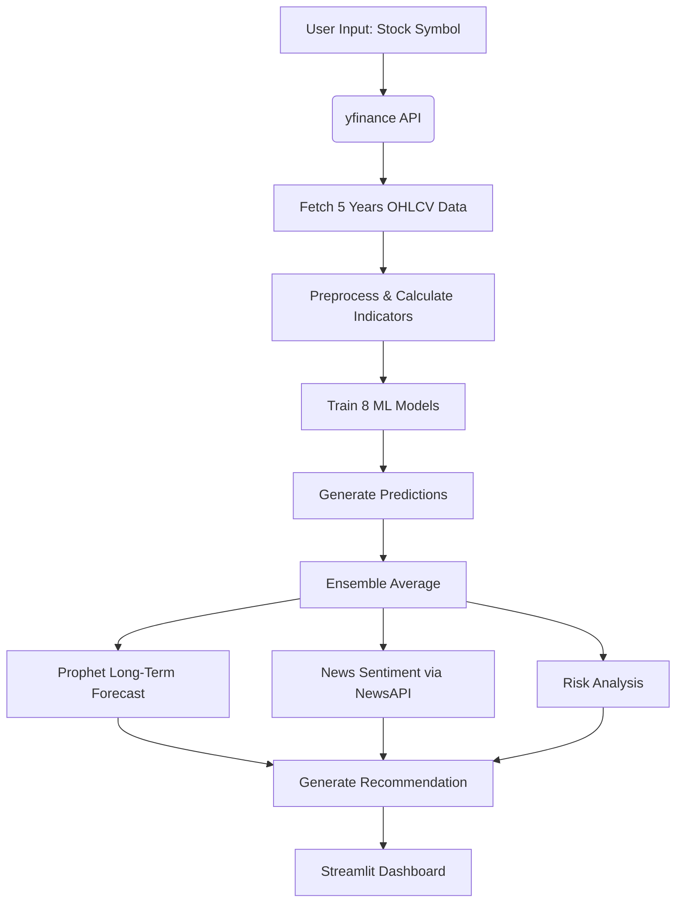

# 📈 Stock Market Prediction System
**An Advanced Multi-Algorithm Machine Learning Dashboard for Stock Price Forecasting & Intelligent Trading Insights**

   

> **8 Powerful ML Models** • **Real-time Yahoo Finance Data** • **20+ Technical Indicators** • **News Sentiment Analysis** • **Ensemble Forecasting** • **Interactive Dashboard**

---

## 🎯 Project Overview

A production-ready **Stock Market Prediction System** that combines **8 state-of-the-art machine learning and time-series models** to forecast stock prices and generate intelligent trading recommendations.

Built with **Streamlit**, this interactive web application provides:
- Real-time stock data via `yfinance`
- Comprehensive technical analysis
- Ensemble predictions (more accurate than single models)
- Long-term forecasting with confidence intervals
- Risk assessment & trading signals
- News sentiment integration

**Perfect for students, researchers, and ML enthusiasts** learning financial modeling and ensemble techniques.

---

## ⚠️ Important Disclaimer

> **This tool is for educational and research purposes only.**
>
> Stock market prediction is inherently uncertain. **No model can guarantee profits.**
>
> This is **NOT financial advice**. Always:
> - Do your own research (DYOR)
> - Consult a qualified financial advisor
> - Only invest money you can afford to lose

---

## 🧠 8 Machine Learning Models Used

| Model                        | Type                    | Best For                          | Key Strength                     |
|-----------------------------|-------------------------|-----------------------------------|----------------------------------|
| **SVR**                     | Support Vector Regression | Short-term, volatile stocks       | Robust to outliers               |
| **Random Forest**           | Ensemble (Bagging)       | Medium-term stable stocks         | Feature importance               |
| **XGBoost**                 | Gradient Boosting        | High-accuracy complex patterns    | State-of-the-art performance     |
| **K-Nearest Neighbors**     | Instance-based           | Pattern similarity detection      | Simple & intuitive               |
| **Gradient Boosting**       | Boosting                 | Outlier-resistant predictions     | High accuracy                    |
| **ARIMA**                   | Statistical Time Series  | Trend & seasonality               | Interpretable                    |
| **Prophet** (Facebook)      | Additive Model           | Long-term with holidays/seasonality | Handles missing data             |
| **LSTM Neural Network**     | Deep Learning (RNN)      | Long-term dependencies            | Captures complex non-linear patterns |

> **Ensemble Prediction** = Average of all valid model outputs → Higher reliability

> **LSTM is optional** (disabled on Python 3.13 due to TensorFlow compatibility)

---

## 📊 20+ Technical Indicators Included

### Momentum
- RSI (14)
- MACD + Signal Line
- Stochastic Oscillator (%K, %D)
- Williams %R
- Rate of Change (ROC)
- Momentum

### Volatility
- Bollinger Bands (20, 2)
- Average True Range (ATR)
- Bandwidth & %B

### Volume
- Volume MA (20)
- Volume Rate (Current / MA)

### Trend
- SMA (20, 50)
- EMA (12, 26)

All indicators are visualized interactively with Plotly.

---

## 🚀 Features

| Feature                        | Description                                                                 |
|-------------------------------|-----------------------------------------------------------------------------|
| Real-time Data                | Live prices from Yahoo Finance                                              |
| Multi-Model Prediction        | 8 models trained and compared                                               |
| Ensemble Forecasting          | Mean prediction with consensus score                                        |
| Prophet Long-Term Forecast    | Up to 365 days ahead with confidence intervals                             |
| Technical Indicator Dashboard | RSI, MACD, Volume, Bollinger Bands, etc.                                    |
| News Sentiment Analysis       | Real-time sentiment from latest news (NewsAPI)                              |
| Risk Assessment               | Volatility-based risk scoring (Low/Medium/High)                             |
| Smart Recommendations         | Buy / Hold / Sell with reasoning                                            |
| Model Comparison Table       | See all 8 predictions side-by-side                                          |
| Interactive Charts            | Candlestick + overlays (SMA, BB)                                            |

---

## 🏗️ System Architecture

